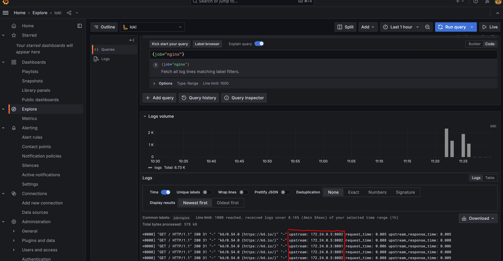
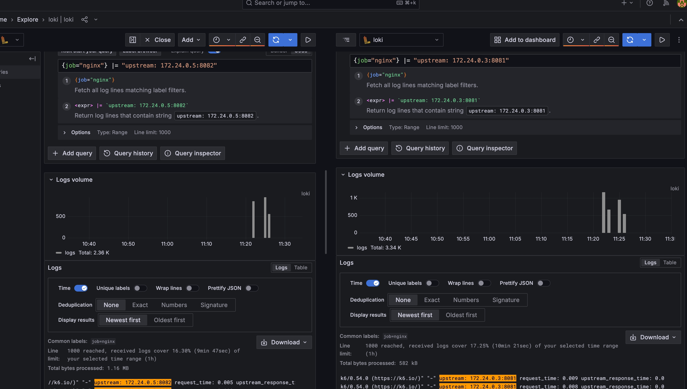

# Load Balancing
This example I added two python app and upstream to the nginx. we are load balancing with nginx.
Now you can run ```docker-compose up --build``` to see app on ```localhost:80```. you will see some request are handled by server 1 and some of them by server 2.
Also if you like to see results on charts, you can open ```localhost:3000``` to see grafan.
I am using prometheus and loki and promtail to read from nginx logs and show the count of that. for instance, in the grafana you should create a data source with loki then you should add ```http://loki:3100/``` to connection part in section of loki in data source.

After than you can check requests in explore section, in this section you can run ```{job="nginx"}```, you will see the total requests. like following picture:





Also you can query like this: ```{job="nginx"} |= "upstream: 172.24.0.5:8082"``` to filter base upstreams:





and if you check the count of requests you will see they are divided correctly.

I should mention I am using k6 to mock requests, you can see config of that in k6 folder.
<b>When you docker-compose up the k6 starts</b> also you can do ```docker-compose run --rm k6``` seperatly to see new requests on grafana.